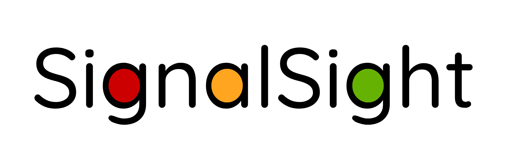

# SignalSight



AI-powered traffic light detection system using YOLOv8 and HSV color classification. Provides real-time driver alerts via audio-visual cues based on traffic light state, distance, and speed. Built with Raspberry Pi 5 and Arduino Uno R3 to enhance driver safety and combat distracted driving.

## Features

- **Real-time Traffic Light Detection**: YOLO-based CNN model for accurate traffic light detection
- **Color Classification**: HSV-based color analysis for red, yellow, and green light states
- **GPS Integration**: Location-aware traffic light database for enhanced accuracy
- **Hardware Integration**: Arduino-based alert system for driver notifications
- **Adaptive Display**: Automatically detects display availability and runs headless when needed
- **State Machine**: Robust state management for reliable detection across varying conditions

## Hardware Requirements

- Raspberry Pi 5 (or Raspberry Pi 4)
- Raspberry Pi Camera Module
- GPS Module (optional)
- Arduino Uno R3 (optional, for alert system)
- MicroSD card (16GB+ recommended)

## Quick Installation

Run the automated setup script to install all dependencies and configure the system:

```bash
cd SignalSight
./setup.sh
```

This will:
- Install system dependencies (OpenCV, build tools, etc.)
- Set up serial port permissions
- Create a Python virtual environment
- Install all Python packages (with automatic numpy compatibility checks)
- Configure the GPS subsystem

**Note:** After installation, you may need to log out and log back in for serial port permissions to take effect.

## Quick Start

### 1. Activate Virtual Environment

```bash
source venv/bin/activate
```

### 2. Run Integrated System (Recommended)

The integrated system runs both CV detection and GPS in parallel:

```bash
python signalsight.py
```

With debug mode (shows live status updates):
```bash
python signalsight.py --debug
```

Run without Arduino (no-data-send mode):
```bash
python signalsight.py --no-arduino
```

Custom Arduino port:
```bash
python signalsight.py --arduino-port /dev/ttyUSB0
```

**The integrated system:**
- **Uses existing code** - Imports and runs CV and GPS logic
- **Acts as glue** - Coordinates execution without duplicating logic
- **Updates propagate** - Changes to CV/GPS code automatically apply
- **CV priority** - CV detection state takes priority over GPS
- **Centralized Arduino** - Single serial connection, no conflicts
- **Auto-detection** - Detects Arduino and runs in no-data-send mode if not connected
- **Headless support** - No display required for operation
- **Debug mode** - Live updating status for both CV and GPS

### 3. Run Individual Components

**Traffic Light Detection Only:**
```bash
cd YOLO_Detection_Model/CNN
python cnn_system.py
```

The system will automatically:
- Detect if a display is available (runs headless if not)
- Connect to Arduino if available (runs without if not)
- Use camera for live detection

Press 'q' to quit (when display is available) or Ctrl+C for headless mode.

**GPS System Only:**
```bash
cd GPS
python gps_system.py
```

For debug output:
```bash
python gps_system.py --debug
```

## Project Structure

```
SignalSight/
├── YOLO_Detection_Model/     # Traffic light detection models
│   ├── CNN/                  # CNN-based detection (YOLO)
│   ├── HSV/                  # HSV color-based detection
│   ├── images/               # Test images
│   ├── best.pt               # Trained YOLO model
│   └── yolov8n.pt            # Base YOLO model
├── GPS/                      # GPS and traffic light database
│   ├── setup/                # GPS setup scripts and database
│   ├── gps_system.py         # Main GPS system
│   └── traffic_light_db.py   # Traffic light database interface
├── tests/                    # Robot Framework test suite
│   ├── unit/                 # Unit tests
│   ├── integration/          # Integration tests
│   ├── e2e/                  # End-to-end tests
│   └── run_all_tests.sh      # Test runner
├── setup.sh                  # Main setup script
├── requirements.txt          # Python dependencies
├── INSTALL.md                # Detailed installation guide
└── README.md                 # This file
```

## Usage

### Traffic Light Detection

**CNN-based detection** (recommended):
```bash
cd YOLO_Detection_Model/CNN
python cnn_system.py
```

**HSV-based detection**:
```bash
cd YOLO_Detection_Model/HSV
python detection_modelv2.py
```

**Real-time state machine** (with Arduino integration):
```bash
cd YOLO_Detection_Model/HSV
python real_time_states.py
```

### Running Tests

Run all tests:
```bash
cd tests
./run_all_tests.sh
```

Run specific test suites:
```bash
./run_unit_tests.sh           # Unit tests
./run_integration_tests.sh    # Integration tests
./run_e2e_tests.sh            # End-to-end tests
./run_gps_tests.sh            # GPS-specific tests
```

Test reports are generated in `tests/reports/`.

## Development

### Activate Development Environment

```bash
source venv/bin/activate
```

### Deactivate When Done

```bash
deactivate
```

### Update Dependencies

```bash
source venv/bin/activate
pip install -r requirements.txt
```

**IMPORTANT:** Do NOT use `--upgrade` flag, as this may install incompatible numpy 2.x.
The requirements.txt pins numpy to 1.x for compatibility with system picamera2/simplejpeg packages.

### Run as System Service (Optional)

To run SignalSight automatically on boot:

```bash
# Copy service file
sudo cp setup/signalsight.service /etc/systemd/system/

# Edit the service file if your username is different from 'signalsight'
sudo nano /etc/systemd/system/signalsight.service

# Enable and start the service
sudo systemctl enable signalsight.service
sudo systemctl start signalsight.service

# Check status
sudo systemctl status signalsight.service

# View logs
sudo journalctl -u signalsight.service -f
```

## Detection Methods

SignalSight uses two complementary approaches:

### 1. CNN-based Detection (YOLO)
- Uses YOLOv8 for object detection
- Detects traffic light bounding boxes
- Classifies light color using trained model
- Location: `YOLO_Detection_Model/CNN/`

### 2. HSV-based Detection
- Uses YOLO for traffic light localization
- Applies HSV color space analysis for state detection
- More robust to lighting variations
- Location: `YOLO_Detection_Model/HSV/`

## Troubleshooting

### Numpy Compatibility Error

If you see this error:
```
ERROR: numpy.dtype size changed, may indicate binary incompatibility
```

This means numpy 2.x was installed, which is incompatible with picamera2. Fix:

```bash
# Remove numpy 2.x from venv
rm -rf venv/lib/python3.*/site-packages/numpy*

# Verify fix (should show numpy 1.x from system)
source venv/bin/activate
python -c "import numpy; print(numpy.__version__)"

# Should output: 1.24.2 or similar 1.x version
```

The setup.sh script now auto-detects and prevents this issue.

### Camera Not Working

Enable camera interface on Raspberry Pi:
```bash
sudo raspi-config
# Navigate to Interface Options > Camera > Enable
sudo reboot
```

### Serial Port Permission Denied

Add user to dialout group:
```bash
sudo usermod -a -G dialout $USER
```
**Important:** Log out and log back in for changes to take effect.

### Model Files Missing

Ensure you're in the correct directory when running detection scripts. Model files (`best.pt`, `yolov8n.pt`) should be in `YOLO_Detection_Model/`.

## License

This project is part of an academic assignment for traffic safety enhancement.
